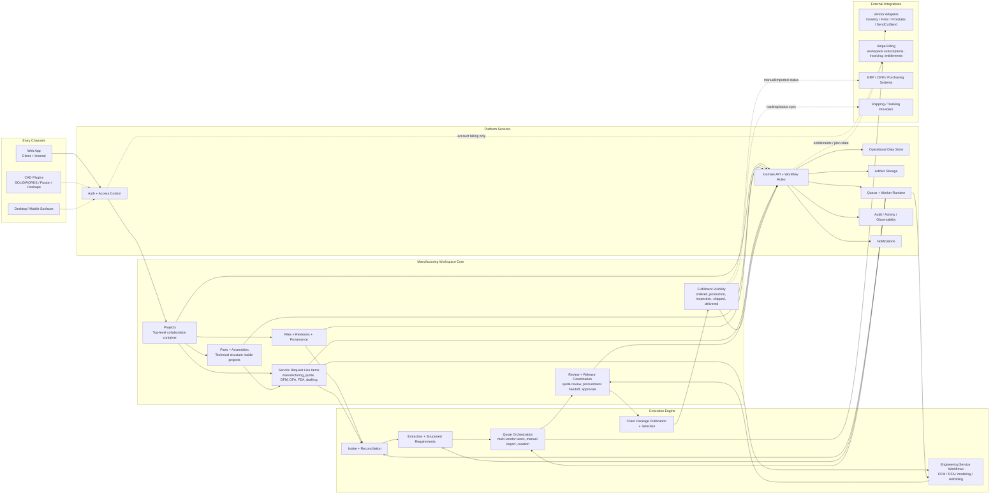

# OverDrafter Aspirational Mermaid Chart

This diagram shows the product's intended long-term shape from [PRD.md](/Users/blainewilson/Documents/GitHub/Overdrafter/PRD.md), [ARCHITECTURE.md](/Users/blainewilson/Documents/GitHub/Overdrafter/ARCHITECTURE.md), [capabilitymap.md](/Users/blainewilson/Documents/GitHub/Overdrafter/capabilitymap.md), and [docs/fulfillment-state-model.md](/Users/blainewilson/Documents/GitHub/Overdrafter/docs/fulfillment-state-model.md).

It intentionally separates the core manufacturing workspace from optional or later integrations such as Stripe, ERP sync, shipping carriers, and supplier systems.

## Reading guide

- The center spine is `Projects -> Parts / Files / Requests -> Review -> Publication -> Fulfillment Visibility`.
- `Service Request Line Items` are the future authoritative unit of work; quote requests become one specialized request path, not the whole model.
- `Stripe` should sit off to the side as account/workspace billing infrastructure, not inside the quoting or procurement lifecycle.
- `ERP`, shipping, and supplier systems should remain separate integrations until OverDrafter intentionally takes on execution ownership.