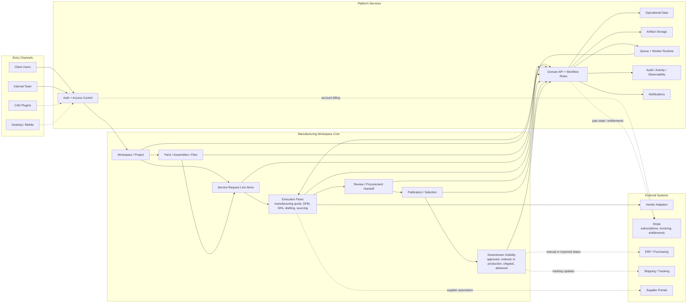

# OverDrafter Aspirational Mermaid Chart v2

This version emphasizes the product model over the current implementation shape.

Key reading:

- `Project` remains the top-level customer-facing container.
- `Service Request Line Items` are the future authoritative unit of work.
- Quote orchestration is one execution flow inside the broader manufacturing workspace.
- Stripe is intentionally sidecar infrastructure, not part of the quote-to-procurement spine.
- Downstream fulfillment states are visibility-oriented until OverDrafter deliberately takes on execution ownership.
