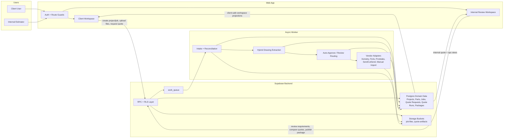

# OverDrafter Mermaid Chart

This diagram reflects the current canonical model described in [README.md](/Users/blainewilson/Documents/GitHub/Overdrafter/README.md) and [ARCHITECTURE.md](/Users/blainewilson/Documents/GitHub/Overdrafter/ARCHITECTURE.md).

