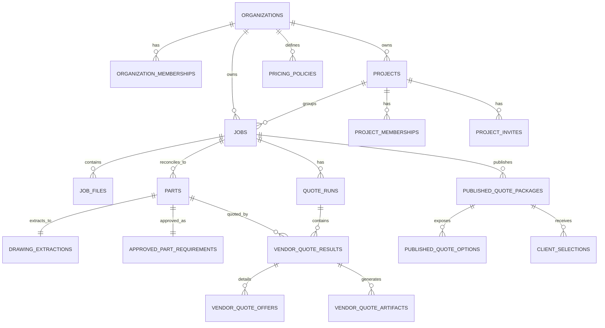
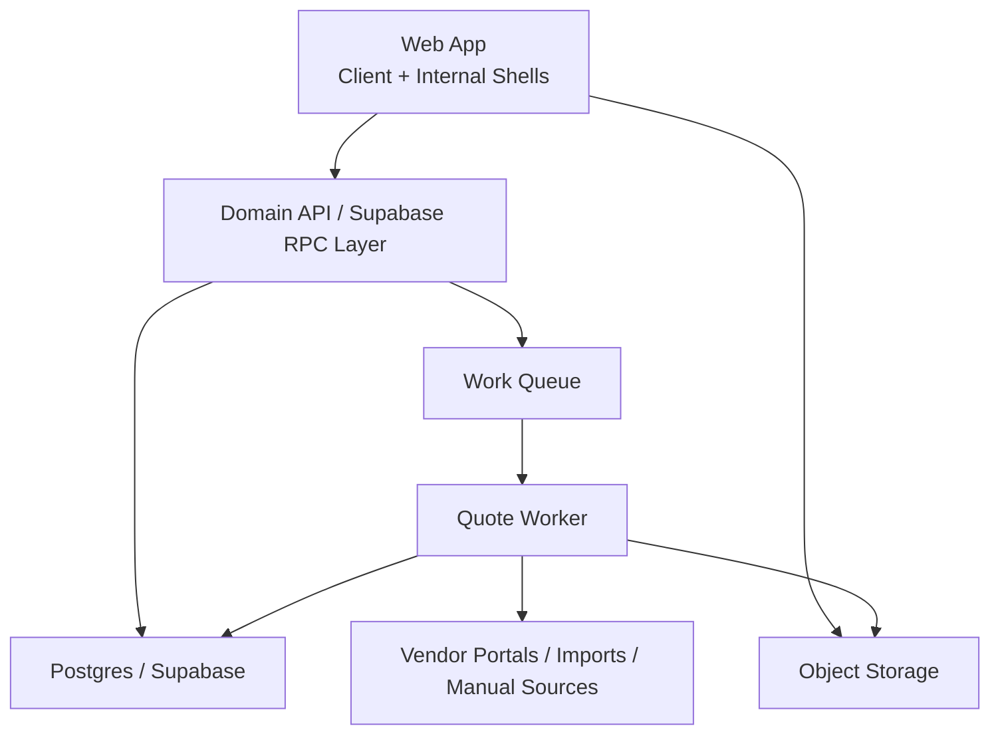

# OverDrafter Reconstruction PRD

Last updated: March 6, 2026

## 1. Document purpose

This document reconstructs the product requirements for OverDrafter from the current repository state. It is intended to serve as a fresh-start product spec if the application is rebuilt from scratch.

This PRD distinguishes between:

- Observed behavior: functionality clearly implemented in the repo
- Inferred intent: product direction implied by the code, schema, or naming
- Recommended rebuild target: what the rebuilt app should preserve or formalize

## 2. Product summary

OverDrafter is a multi-role CNC quoting platform that turns uploaded CAD and drawing files into client-selectable quote packages.

At a high level, the product does four things:

1. Lets clients create part requests and organize them into private/shareable projects
2. Lets an internal estimating team review extracted specs, approve requirements, and compare vendor quote results
3. Runs asynchronous extraction and quote orchestration through a worker and queue
4. Publishes curated client-facing quote packages so a customer can choose the best option

The current implementation combines:

- A client-facing workspace with a chat-like intake surface
- An internal operations dashboard and review flow
- A Supabase-backed data model with RLS, storage, and RPCs
- A separate Node worker for extraction and vendor quote automation

## 3. Product vision

### Vision statement

Enable a CNC buyer to go from "I have a part and a drawing" to "I selected a vetted quote option" in one workspace, while giving internal estimators full control over review, sourcing, pricing, and publication.

### Core jobs to be done

For clients:

- Upload a part package quickly
- Track parts and organize them by project
- Share projects with collaborators
- Review published quote options and make a selection

For internal estimators:

- Turn uploaded files into structured part requirements
- Compare automated and manual vendor quotes
- Apply pricing policy and publish curated options
- Keep the workflow auditable and operationally visible

## 4. Target users

### Guest user

- Can land on the home screen
- Can open sign-in/sign-up
- Cannot create or manage parts without authenticating

### Client user

- Owns or belongs to a hidden workspace
- Creates parts/drafts
- Uploads CAD/drawing files
- Organizes parts into projects
- Shares project access
- Reviews published packages
- Selects a quote option

### Internal estimator

- Reviews jobs and extracted specs
- Approves part requirements
- Starts quote runs
- Records manual quotes
- Publishes client packages

### Internal admin

- Has estimator capabilities
- Can manage workspace access and role assignments
- Must retain at least one admin per workspace

### Project collaborator

- Invited into a specific project
- Can access project-scoped parts without seeing unrelated workspace data
- Current project roles observed: `owner`, `editor`

## 5. Product goals

### Primary goals

- Reduce friction in part intake
- Preserve a strong internal review checkpoint before quoting/publishing
- Centralize vendor comparison in one canonical job record
- Provide a clean client experience for collaboration and selection
- Maintain secure access boundaries between workspaces, projects, and internal-only data

### Secondary goals

- Support mixed sourcing models: browser automation, imported spreadsheet quotes, and manual intake
- Support long-running asynchronous work via queue/worker
- Keep an audit trail for sensitive actions
- Make the app usable for both one-off parts and grouped project workflows

## 6. Non-goals

The current repo does not indicate that the product should own:

- Direct ordering, procurement, or PO issuance
- Billing/subscriptions
- ERP/CRM sync
- Real-time chat or threaded messaging
- Full manufacturing execution
- Native mobile apps
- Public marketing CMS functionality

These may be future opportunities, but they are not core to the current product.

## 7. Product principles for the rebuild

- Intake should feel fast and lightweight for clients
- Internal review should be explicit, not implicit
- Published client options must be traceable to source vendor quotes and pricing policy
- All state transitions that matter operationally should be modeled in the database
- Automation failures must fail closed and remain reviewable
- Internal-only sourcing data must never leak into the client package surface
- The product should expose `workspace` as the tenancy concept; `organization` and `organization membership` should remain backend implementation details
- The product should assume one workspace per user/company in v1 and avoid premature multi-workspace UX

## 8. Core product flows

### 8.1 Client account bootstrap

Observed behavior:

- A signed-in, verified user with no workspace access is automatically bootstrapped into a workspace
- Most users become `client`
- An allowlisted email can bootstrap as `internal_admin`

Recommended rebuild target:

- Keep automatic first-run workspace creation
- Treat `workspace` as the user-facing concept and hide `organization_memberships` entirely
- Assume one workspace per user/company in v1
- Do not ship workspace switching or membership-management UX unless a real use case appears

### 8.2 Client part intake

Observed behavior:

- Client home uses a chat-like composer
- Users can type a prompt, upload files, or both
- Draft title is derived from prompt or first file name
- Supported upload types include PDF and common CAD formats
- Files are uploaded to storage, attached to the job, reconciled into parts, and extraction is queued

Recommended rebuild target:

- Preserve single-step part intake
- Keep prompt + file upload combined into one entry point
- Preserve hard file validation and size limits
- Consider explicit progress states for upload, reconciliation, and queueing

### 8.3 Job/part reconciliation

Observed behavior:

- Files are attached at the job level
- A reconciliation RPC groups files into parts using normalized names
- CAD and drawing files are paired where possible

Recommended rebuild target:

- Preserve deterministic pairing logic
- Expose pairing confidence and mismatches in UI
- Allow manual override when file matching is wrong

### 8.4 Extraction review

Observed behavior:

- Worker creates or updates `drawing_extractions`
- Internal job detail shows extracted description, part number, revision, material, finish, tolerance, evidence, and warnings
- Internal users edit and approve normalized part requirements before quoting

Recommended rebuild target:

- Preserve extraction as advisory, not authoritative
- Preserve explicit approval before quote automation
- Support versioning or history for approved requirements in a future iteration

### 8.5 Quote run orchestration

Observed behavior:

- Internal users start a quote run after requirements approval
- Quote run creates vendor quote tasks
- Worker processes vendor quote tasks asynchronously
- Current adapter strategy supports simulation mode and partial live mode

Recommended rebuild target:

- Preserve async quote runs as first-class entities
- Preserve per-vendor result records, not just one combined quote
- Add retry, idempotency, and concurrency hardening in the rebuild

### 8.6 Manual quote intake

Observed behavior:

- Internal users can record quotes from manual supplier replies
- Manual intake supports pasted summary text, uploaded evidence, multiple offer lanes, quote refs, dates, material, finish, and notes
- Manual quotes write normalized offer lanes directly into the compare view

Recommended rebuild target:

- Keep manual intake as a primary path, not a fallback afterthought
- Support mixed automated/manual quote runs
- Preserve artifact uploads and source traceability

### 8.7 Internal compare and publication

Observed behavior:

- Internal detail page shows raw total, projected client price, lead time, DFM issues, offer lanes, and readiness
- Publication readiness can block auto-publish
- Internal users can still force publication with explicit approval
- Published packages create three client option lanes: `lowest_cost`, `fastest_delivery`, `balanced`

Recommended rebuild target:

- Preserve internal comparison as the control point for packaging
- Preserve readiness checks and forced override path
- Make pricing policy application explicit in the UI

### 8.8 Client package review and selection

Observed behavior:

- Client package page shows curated options, prices, lead times, and client summary
- Client can leave a note and select an option
- Latest selection is displayed back to the client

Recommended rebuild target:

- Preserve a simple decision surface
- Avoid exposing raw vendor internals
- Add downstream status after selection in a future iteration

### 8.9 Projects and collaboration

Observed behavior:

- Clients can create projects
- Parts can be assigned to and removed from projects
- Projects can be renamed or deleted
- Owners can invite collaborators by email
- Shared invite links resolve to `/shared/:inviteToken`

Recommended rebuild target:

- Preserve project-centric collaboration
- Keep workspace-wide privacy with project-scoped sharing
- Add invite email sending in the rebuilt product if desired; current repo only generates/copies links

### 8.10 Personalization and workspace organization

Observed behavior:

- Users can pin projects and parts in the sidebar
- Sidebar supports organization, sorting, and "relevant" filtering preferences in local storage
- Search/filtering is available in project views

Recommended rebuild target:

- Preserve lightweight personalization
- Move search and filtering server-side if dataset size grows

## 9. Feature inventory

### 9.1 Authentication and identity

Observed:

- Email/password auth
- Email verification gating for sensitive actions
- Social sign-in via Google, Microsoft/Azure, and Apple
- Password reset and PKCE callback flow

Requirements:

- All write-sensitive flows require authenticated users
- Sensitive actions require verified auth or trusted social provider auth
- Session handling must survive browser refresh and callback redirects

### 9.2 Roles and permissions

Observed:

- Organization roles: `client`, `internal_estimator`, `internal_admin`
- Project roles: `owner`, `editor`
- Internal-only access to pricing, extractions, quote runs, vendor results, artifacts, and queue data

Requirements:

- Authorization must be enforced in both UI and backend
- Internal-only data must remain inaccessible to client/project-only users
- Project sharing must not grant workspace-wide visibility
- Workspace access should stay modeled internally even if the product does not expose workspace membership as a concept

### 9.3 Client workspace

Observed:

- Chat-style landing page
- Prompt composer with drag/paste/file upload
- Sidebar with projects, parts, pins, and context actions
- Part detail page with files, package links, tags, and project reassignment

Requirements:

- Fast part creation
- Clear navigation between workspace, project, part, and package
- Low-friction sharing

### 9.4 Internal operations dashboard

Observed:

- Metrics for total jobs, jobs in review, active quote runs, published packages
- Admin-only team access management
- Create Job CTA

Requirements:

- Internal users must have an overview of workload and publication volume
- Admins must be able to promote/demote users safely

### 9.5 Job intake and files

Observed:

- Jobs have title, description, source, tags, pricing policy, and files
- File kinds: `cad`, `drawing`, `artifact`, `other`
- Upload validation for CNC-friendly file types
- STEP preview supported in browser

Requirements:

- Preserve job-level canonical record
- Preserve multi-file upload and type inference
- Preserve file provenance and metadata

### 9.6 CAD preview

Observed:

- STEP/STP files are meshed client-side using `occt-import-js`
- Preview rendered with Three.js
- Non-STEP CAD still shows as attached but not previewable

Requirements:

- Preserve lightweight browser preview for common 3D files
- Keep preview optional and non-blocking

### 9.7 Quote automation

Observed:

- Worker supports `simulate` and `live` modes
- Vendor adapters exist for Xometry, Fictiv, Protolabs, and SendCutSend
- Xometry has the most explicit live automation path
- Queue tasks include repair candidates for selector failures

Requirements:

- Adapter contract must remain vendor-specific but normalized at the result layer
- Live automation must fail closed on login/captcha/selector issues
- Simulation mode should remain available for test/demo environments

### 9.8 Manual/imported vendor offers

Observed:

- Additional vendors supported for import/manual lanes: PartsBadger and FastDMS
- Vendor quote offers are normalized into `vendor_quote_offers`
- Published options can reference a specific source offer row

Requirements:

- Preserve distinction between quote result summary and underlying offer lanes
- Preserve ability to ingest spreadsheet/manual data from non-automated vendors

### 9.9 Publication and client options

Observed:

- Published package stores summary, publish metadata, pricing policy, and options
- Client options map to curated quote lanes

Requirements:

- Published packages must be immutable enough to remain auditable
- Option selection should remain tied to the specific package version

### 9.10 Auditability

Observed:

- Audit event table exists
- Major RPCs log important actions

Requirements:

- Preserve audit events for job creation, membership changes, publication, and selection

## 10. Domain model

### Core entities

- `organizations`: top-level tenancy/workspace boundary
- `organization_memberships`: user membership and org role
- `pricing_policies`: markup rules used for publication
- `jobs`: top-level RFQ/part request container
- `job_files`: uploaded CAD/drawing/artifact files
- `parts`: normalized part units reconciled from files
- `drawing_extractions`: extracted spec payload and evidence
- `approved_part_requirements`: estimator-approved quoting inputs
- `quote_runs`: a batch quoting attempt for a job
- `vendor_quote_results`: per-part, per-vendor quote summary
- `vendor_quote_offers`: underlying offer lanes/details
- `vendor_quote_artifacts`: screenshots, HTML, trace, JSON, or evidence
- `published_quote_packages`: client-facing published package
- `published_quote_options`: curated client options
- `client_selections`: chosen client option and note
- `projects`: client collaboration container
- `project_memberships`: project access control
- `project_invites`: invitation records and tokens
- `user_pinned_projects`, `user_pinned_jobs`: personalization
- `audit_events`: operational audit trail
- `work_queue`: async task queue

### Relationship summary

## Appendix A. Schema reference

This appendix captures the concrete schema surface observed in the repository so a rebuild can reproduce the domain model without re-deriving it from migrations.

For the rebuild, these schema names should remain internal implementation details. The user-facing product should talk about `workspace` and `workspace access`, not `organization` and `organization membership`.

### A.1 Schema namespaces

- `auth`: Supabase-managed identity schema. `auth.users` is referenced by memberships, ownership, and actor fields.
- `public`: Primary application schema for business data, queueing, audit events, and RPCs.
- `private`: Internal-only schema currently used for platform-admin bootstrap allowlisting.
- `storage`: Supabase object storage metadata used for `job-files` and `quote-artifacts`.

### A.2 Public enum schemas

- `app_role`: `client`, `internal_estimator`, `internal_admin`
- `job_status`: `uploaded`, `extracting`, `needs_spec_review`, `ready_to_quote`, `quoting`, `awaiting_vendor_manual_review`, `internal_review`, `published`, `client_selected`, `closed`
- `vendor_name`: `xometry`, `fictiv`, `protolabs`, `sendcutsend`, `partsbadger`, `fastdms`
- `vendor_status`: `queued`, `running`, `instant_quote_received`, `official_quote_received`, `manual_review_pending`, `manual_vendor_followup`, `failed`, `stale`
- `client_option_kind`: `lowest_cost`, `fastest_delivery`, `balanced`
- `job_file_kind`: `cad`, `drawing`, `artifact`, `other`
- `extraction_status`: `needs_review`, `approved`
- `quote_run_status`: `queued`, `running`, `completed`, `failed`, `published`
- `queue_task_type`: `extract_part`, `run_vendor_quote`, `poll_vendor_quote`, `publish_package`, `repair_adapter_candidate`
- `queue_task_status`: `queued`, `running`, `completed`, `failed`, `cancelled`
- `project_role`: `owner`, `editor`
- `project_invite_status`: `pending`, `accepted`, `revoked`, `expired`

### A.3 Public relational tables

- `organizations`
  - Columns: `id uuid PK`, `name text`, `slug text unique`, `created_at timestamptz`, `updated_at timestamptz`
  - Purpose: top-level tenant/workspace boundary

- `organization_memberships`
  - Columns: `id uuid PK`, `organization_id uuid FK`, `user_id uuid FK auth.users`, `role app_role`, `created_at timestamptz`
  - Constraints: unique `organization_id, user_id`
  - Purpose: workspace membership and org role

- `pricing_policies`
  - Columns: `id uuid PK`, `organization_id uuid FK`, `version text`, `markup_percent numeric(8,4)`, `currency_minor_unit numeric(10,4)`, `is_active boolean`, `notes text`, `created_at timestamptz`
  - Constraints: unique `organization_id, version`
  - Purpose: pricing and markup policy applied at publication time

- `projects`
  - Columns: `id uuid PK`, `organization_id uuid FK`, `owner_user_id uuid FK auth.users`, `name text`, `description text`, `created_at timestamptz`, `updated_at timestamptz`
  - Purpose: client collaboration container inside a workspace

- `project_memberships`
  - Columns: `id uuid PK`, `project_id uuid FK`, `user_id uuid FK auth.users`, `role project_role`, `created_at timestamptz`
  - Constraints: unique `project_id, user_id`
  - Purpose: project-scoped access control

- `project_invites`
  - Columns: `id uuid PK`, `project_id uuid FK`, `email text`, `role project_role`, `invited_by uuid FK auth.users`, `accepted_by uuid FK auth.users nullable`, `token text unique`, `status project_invite_status`, `expires_at timestamptz`, `accepted_at timestamptz nullable`, `revoked_at timestamptz nullable`, `created_at timestamptz`
  - Purpose: invitation workflow for project sharing

- `jobs`
  - Columns: `id uuid PK`, `organization_id uuid FK`, `created_by uuid FK auth.users`, `project_id uuid FK nullable`, `title text`, `description text nullable`, `status job_status`, `source text`, `tags text[]`, `active_pricing_policy_id uuid FK nullable`, `created_at timestamptz`, `updated_at timestamptz`
  - Purpose: canonical RFQ/part-request record

- `job_files`
  - Columns: `id uuid PK`, `job_id uuid FK`, `organization_id uuid FK`, `uploaded_by uuid FK auth.users`, `storage_bucket text`, `storage_path text unique`, `original_name text`, `normalized_name text`, `file_kind job_file_kind`, `mime_type text nullable`, `size_bytes bigint nullable`, `matched_part_key text nullable`, `created_at timestamptz`
  - Purpose: uploaded CAD, drawing, and other artifacts linked to a job

- `parts`
  - Columns: `id uuid PK`, `job_id uuid FK`, `organization_id uuid FK`, `name text`, `normalized_key text`, `cad_file_id uuid FK nullable`, `drawing_file_id uuid FK nullable`, `quantity integer`, `created_at timestamptz`, `updated_at timestamptz`
  - Constraints: unique `job_id, normalized_key`
  - Purpose: normalized part units reconciled from uploaded files

- `drawing_extractions`
  - Columns: `id uuid PK`, `part_id uuid unique FK`, `organization_id uuid FK`, `extractor_version text`, `extraction jsonb`, `confidence numeric(6,4) nullable`, `warnings jsonb`, `evidence jsonb`, `status extraction_status`, `created_at timestamptz`, `updated_at timestamptz`
  - Purpose: machine/system-extracted part metadata and supporting evidence

- `approved_part_requirements`
  - Columns: `id uuid PK`, `part_id uuid unique FK`, `organization_id uuid FK`, `approved_by uuid FK auth.users`, `description text nullable`, `part_number text nullable`, `revision text nullable`, `material text`, `finish text nullable`, `tightest_tolerance_inch numeric(10,4) nullable`, `quantity integer`, `applicable_vendors vendor_name[]`, `spec_snapshot jsonb`, `approved_at timestamptz`, `created_at timestamptz`, `updated_at timestamptz`
  - Purpose: estimator-approved inputs used for quote execution

- `quote_runs`
  - Columns: `id uuid PK`, `job_id uuid FK`, `organization_id uuid FK`, `initiated_by uuid FK auth.users`, `status quote_run_status`, `requested_auto_publish boolean`, `created_at timestamptz`, `updated_at timestamptz`
  - Purpose: a single quoting attempt/batch for a job

- `vendor_quote_results`
  - Columns: `id uuid PK`, `quote_run_id uuid FK`, `part_id uuid FK`, `organization_id uuid FK`, `vendor vendor_name`, `status vendor_status`, `unit_price_usd numeric(12,2) nullable`, `total_price_usd numeric(12,2) nullable`, `lead_time_business_days integer nullable`, `quote_url text nullable`, `dfm_issues jsonb`, `notes jsonb`, `raw_payload jsonb`, `created_at timestamptz`, `updated_at timestamptz`
  - Constraints: unique `quote_run_id, part_id, vendor`
  - Purpose: per-vendor quote summary per part

- `vendor_quote_offers`
  - Columns: `id uuid PK`, `vendor_quote_result_id uuid FK`, `organization_id uuid FK`, `offer_key text`, `supplier text`, `lane_label text`, `sourcing text nullable`, `tier text nullable`, `quote_ref text nullable`, `quote_date date nullable`, `unit_price_usd numeric(12,2) nullable`, `total_price_usd numeric(12,2) nullable`, `lead_time_business_days integer nullable`, `ship_receive_by text nullable`, `due_date text nullable`, `process text nullable`, `material text nullable`, `finish text nullable`, `tightest_tolerance text nullable`, `tolerance_source text nullable`, `thread_callouts text nullable`, `thread_match_notes text nullable`, `notes text nullable`, `sort_rank integer`, `raw_payload jsonb`, `created_at timestamptz`, `updated_at timestamptz`
  - Constraints: unique `vendor_quote_result_id, offer_key`
  - Purpose: normalized quote lanes beneath a vendor result

- `vendor_quote_artifacts`
  - Columns: `id uuid PK`, `vendor_quote_result_id uuid FK`, `organization_id uuid FK`, `artifact_type text`, `storage_bucket text`, `storage_path text unique`, `metadata jsonb`, `created_at timestamptz`
  - Purpose: screenshots, HTML, traces, JSON payloads, and uploaded evidence

- `published_quote_packages`
  - Columns: `id uuid PK`, `job_id uuid FK`, `quote_run_id uuid unique FK`, `organization_id uuid FK`, `published_by uuid FK auth.users`, `pricing_policy_id uuid FK`, `auto_published boolean`, `client_summary text nullable`, `created_at timestamptz`, `published_at timestamptz`
  - Purpose: client-visible package generated from a quote run

- `published_quote_options`
  - Columns: `id uuid PK`, `package_id uuid FK`, `organization_id uuid FK`, `option_kind client_option_kind`, `label text`, `published_price_usd numeric(12,2)`, `lead_time_business_days integer nullable`, `comparison_summary text nullable`, `source_vendor_quote_id uuid FK`, `source_vendor_quote_offer_id uuid FK nullable`, `markup_policy_version text`, `created_at timestamptz`
  - Constraints: unique `package_id, option_kind`
  - Purpose: curated client decision options derived from vendor results/offers

- `client_selections`
  - Columns: `id uuid PK`, `package_id uuid FK`, `option_id uuid FK`, `organization_id uuid FK`, `selected_by uuid FK auth.users`, `note text nullable`, `created_at timestamptz`
  - Purpose: client package decision record

- `audit_events`
  - Columns: `id uuid PK`, `organization_id uuid FK`, `actor_user_id uuid FK auth.users nullable`, `job_id uuid FK nullable`, `package_id uuid FK nullable`, `event_type text`, `payload jsonb`, `created_at timestamptz`
  - Purpose: append-only-ish audit/event log for business actions

- `work_queue`
  - Columns: `id uuid PK`, `organization_id uuid FK`, `job_id uuid FK nullable`, `part_id uuid FK nullable`, `quote_run_id uuid FK nullable`, `package_id uuid FK nullable`, `task_type queue_task_type`, `status queue_task_status`, `payload jsonb`, `attempts integer`, `available_at timestamptz`, `locked_at timestamptz nullable`, `locked_by text nullable`, `last_error text nullable`, `created_at timestamptz`, `updated_at timestamptz`
  - Purpose: async execution queue for extraction, quote automation, publishing, and repair tasks

- `user_pinned_projects`
  - Columns: `id uuid PK`, `user_id uuid FK auth.users`, `project_id uuid FK`, `created_at timestamptz`
  - Constraints: unique `user_id, project_id`
  - Purpose: per-user sidebar pinning for projects

- `user_pinned_jobs`
  - Columns: `id uuid PK`, `user_id uuid FK auth.users`, `job_id uuid FK`, `created_at timestamptz`
  - Constraints: unique `user_id, job_id`
  - Purpose: per-user sidebar pinning for parts/jobs

### A.4 Private schema tables

- `private.platform_admin_emails`
  - Columns: `email text PK`, `created_at timestamptz`
  - Purpose: bootstrap allowlist used to grant self-service `internal_admin` access for specific email addresses

### A.5 Canonical JSON payload schemas

- `drawing_extractions.extraction`
  - Canonical shape observed in the app:
  - `description: string | null`
  - `partNumber: string | null`
  - `revision: string | null`
  - `material: { raw: string | null, normalized: string | null, confidence: number }`
  - `finish: { raw: string | null, normalized: string | null, confidence: number }`
  - `tolerances: { tightest: string | null, valueInch: number | null, confidence: number }`

- `drawing_extractions.evidence`
  - Array of evidence items:
  - `{ field: string, page: number, snippet: string, confidence: number }`

- `approved_part_requirements.spec_snapshot`
  - Snapshot of approved part requirements at approval time
  - Used to preserve quoting inputs independent of later edits

- `vendor_quote_results.raw_payload`
  - Vendor-specific or source-specific structured payload
  - Manual intake payload observed includes fields such as `source`, `sourceText`, `summaryOfferKey`, and `offerCount`

- `vendor_quote_offers.raw_payload`
  - Original per-offer row/object retained after normalization

- `audit_events.payload`
  - Event-specific JSON envelope with action metadata

- `work_queue.payload`
  - Task-specific parameters such as vendor, error context, or publication metadata

### A.6 Storage schemas

- Bucket: `job-files`
  - Purpose: uploaded CAD, drawings, and job-linked source files
  - Common path convention in frontend: `{jobId}/{timestamp}-{originalFileName}`

- Bucket: `quote-artifacts`
  - Purpose: internal-only quote artifacts and manual evidence
  - Common manual-intake path convention: `manual-quotes/{jobId}/{timestamp}-{uuid}-{sanitizedFileName}`

### A.7 RPC/function surface used by the frontend

- `api_create_self_service_organization(p_organization_name)` -> `uuid`
- `api_list_organization_memberships(p_organization_id)` -> `jsonb`
- `api_update_organization_membership_role(p_membership_id, p_role)` -> `uuid`
- `api_create_project(p_name, p_description)` -> `uuid`
- `api_update_project(p_project_id, p_name, p_description)` -> `uuid`
- `api_delete_project(p_project_id)` -> `uuid`
- `api_invite_project_member(p_project_id, p_email, p_role)` -> invite payload
- `api_accept_project_invite(p_token)` -> `uuid` project id
- `api_remove_project_member(p_project_membership_id)` -> `uuid`
- `api_create_client_draft(p_title, p_description, p_project_id, p_tags)` -> `uuid` job id
- `api_assign_job_to_project(p_job_id, p_project_id)` -> `uuid`
- `api_remove_job_from_project(p_job_id)` -> `uuid`
- `api_create_job(p_organization_id, p_title, p_description, p_source, p_tags)` -> `uuid`
- `api_attach_job_file(p_job_id, p_storage_bucket, p_storage_path, p_original_name, p_file_kind, p_mime_type, p_size_bytes)` -> attachment id
- `api_reconcile_job_parts(p_job_id)` -> pairing summary payload
- `api_request_extraction(p_job_id)` -> queued task count or similar numeric result
- `api_approve_job_requirements(p_job_id, p_requirements)` -> approved count
- `api_start_quote_run(p_job_id, p_auto_publish_requested)` -> `uuid`
- `api_get_quote_run_readiness(p_quote_run_id)` -> readiness payload
- `api_publish_quote_package(p_job_id, p_quote_run_id, p_client_summary, p_force)` -> `uuid`
- `api_record_manual_vendor_quote(p_job_id, p_part_id, p_vendor, p_status, p_summary_note, p_source_text, p_quote_url, p_offers, p_artifacts)` -> quote result payload
- `api_select_quote_option(p_package_id, p_option_id, p_note)` -> selection id

### A.8 Access-control schema rules that matter to the rebuild

- Organization-level access is controlled through `organization_memberships`
- Project-level access is controlled through `project_memberships` and `project_invites`
- Internal-only records include:
  - `pricing_policies`
  - `drawing_extractions`
  - `approved_part_requirements`
  - `quote_runs`
  - `vendor_quote_results`
  - `vendor_quote_offers`
  - `vendor_quote_artifacts`
  - `audit_events`
  - `work_queue`
- Client-readable records are limited to records reachable through authorized jobs/projects/packages
- Pin tables are only visible and mutable by the owning user

## 11. State model

### Job statuses observed

- `uploaded`
- `extracting`
- `needs_spec_review`
- `ready_to_quote`
- `quoting`
- `awaiting_vendor_manual_review`
- `internal_review`
- `published`
- `client_selected`
- `closed`

### Vendor statuses observed

- `queued`
- `running`
- `instant_quote_received`
- `official_quote_received`
- `manual_review_pending`
- `manual_vendor_followup`
- `failed`
- `stale`

### Queue task types observed

- `extract_part`
- `run_vendor_quote`
- `poll_vendor_quote`
- `publish_package`
- `repair_adapter_candidate`

### Recommended lifecycle

```mermaid
flowchart LR
  A["Client Draft / Job Created"] --> B["Files Uploaded"]
  B --> C["Parts Reconciled"]
  C --> D["Extraction Queued"]
  D --> E["Needs Spec Review"]
  E --> F["Approved Requirements Saved"]
  F --> G["Quote Run Started"]
  G --> H["Vendor Results Arrive"]
  H --> I["Internal Review / Readiness"]
  I --> J["Published Package"]
  J --> K["Client Selection"]
```

## 12. System architecture

### 12.1 Frontend

Observed stack:

- React 18
- TypeScript
- Vite
- React Router
- TanStack Query
- Tailwind CSS + shadcn/ui
- Supabase JS client
- Three.js + `occt-import-js` for CAD preview

Observed architecture traits:

- Single-page application
- Page-level data fetching through React Query
- Mix of table reads and RPC writes
- Client-side local storage for some UX preferences and auth/session helpers

Recommended rebuild target:

- Keep SPA architecture unless SEO/public marketing becomes a priority
- Move more business workflow rules out of page components and into a domain/service layer
- Treat the client and internal shells as separate applications sharing a common domain library

### 12.2 Supabase backend

Observed responsibilities:

- Auth and session management
- Postgres as primary transactional store
- RLS for org/project/internal boundaries
- Storage buckets for job files and quote artifacts
- RPCs for state transitions and sensitive write operations

Recommended rebuild target:

- Preserve strong RPC/state-transition pattern for writes
- Continue using RLS if Supabase remains the backend
- If moving away from Supabase, recreate RLS semantics in a dedicated API layer

### 12.3 Worker

Observed responsibilities:

- Claim tasks from `work_queue`
- Run extraction
- Run vendor adapters
- Persist results and artifacts
- Emit repair-candidate tasks for automation failures
- Expose `/healthz` and `/readyz`

Recommended rebuild target:

- Preserve separate long-lived worker process
- Add stronger locking, idempotency, retries, dead-letter handling, and structured logging
- Preserve service-role isolation from the frontend

### 12.4 Deployment model

Observed:

- Frontend builds via Vite
- Worker is packaged separately and intended for Cloud Run
- Worker uses Secret Manager for service key and Xometry storage state

Recommended rebuild target:

- Preserve separate deploy units for app and worker
- Add environment promotion and schema migration discipline if not already present

## 13. Security and privacy requirements

### Auth requirements

- Users must authenticate before creating or modifying data
- Sensitive actions require verified email or trusted OAuth provider auth

### Authorization requirements

- Internal workspace-access records gate workspace-level access
- Project membership gates shared project access
- Internal role gates raw vendor, queue, pricing, extraction, and publication features

### Storage requirements

- Job files must only be readable by authorized job viewers
- Quote artifacts must remain internal-only unless explicitly made client-safe

### Worker requirements

- Worker must use service-role credentials unavailable to the browser
- Automation credentials and browser session state must be secret-managed

## 14. Operational and non-functional requirements

### Performance

- Client intake should feel instantaneous until upload begins
- Internal job detail must load aggregate job data in a single coherent screen
- Sidebar/project navigation should stay responsive with growing job counts

### Reliability

- Queue tasks must be retryable
- Quote runs must tolerate partial vendor failure
- Manual intake must unblock progress when automation fails

### Observability

- Track queue depth and worker health
- Record last error for failed tasks
- Preserve audit events for major business actions

### Scalability

- Current client search is effectively client-side over accessible jobs
- Rebuild should support server-side search/filtering once data volumes grow materially

## 15. Current limitations and gaps to address in a rebuild

These are important because a rebuild should preserve the product, not necessarily every implementation detail.

- Extraction is currently heuristic/scaffolded, not production-grade
- Live vendor automation appears incomplete beyond the Xometry path
- Invite generation exists, but outbound email sending is not implemented in this repo
- Backend multi-workspace support exists in schema, but the current UI already behaves like a single-workspace product
- Queue claiming is simple and should be hardened for concurrency
- Much business logic currently lives in frontend pages rather than a central domain layer
- Search/filtering is lightweight and not yet optimized for large datasets
- There is special-case logic for the `dmrifles@gmail.com` demo/import workspace that should be treated as seed/demo behavior, not core product design

## 16. Rebuild recommendations

### Product model recommendation

- Keep the tenancy layer internally, but hide it
- Treat it as `workspace`, not `organization membership`
- Assume one workspace per user/company in v1
- Remove workspace switching and any membership-options UI until there is a real use case

### Preserve without debate

- The core domain model: jobs, parts, approved requirements, quote runs, vendor results, published packages
- The split between client collaboration and internal estimating
- Project-scoped sharing
- Manual quote intake alongside automation
- Async worker architecture

### Improve materially

- Introduce a formal backend service layer or BFF around domain workflows
- Centralize status transitions and invariants
- Add notifications for invites, quote publication, and client selections
- Add better failure recovery and retry policies for async jobs
- Add version history for approved requirements and published packages if needed
- Keep backend workspace support without exposing workspace switching in v1

### Likely architecture target

## 17. Suggested phased rebuild plan

### Phase 1: Foundation

- Authentication
- Workspace bootstrap
- Roles and permissions
- Jobs/files/parts/projects schema
- Client workspace shell
- Internal dashboard shell

### Phase 2: Core quoting workflow

- File upload and reconciliation
- Extraction pipeline
- Approved requirements UI
- Quote runs
- Vendor result persistence
- Manual quote intake

### Phase 3: Client publication

- Pricing policy application
- Readiness checks
- Published packages
- Client option selection
- Audit events

### Phase 4: Automation hardening

- Live vendor adapters
- Retry/failure handling
- Repair workflows
- Operational dashboards and alerts

## 18. Open product questions

These are not blockers for a first draft rebuild, but they should be answered before implementation locks in.

- Should project invites send emails automatically or remain copy-link based?
- Is a job always a single part request, or should multi-part jobs be a first-class visible concept for clients?
- Should approved requirements be versioned instead of overwritten?
- Should publication be immutable, or can packages be revised in place?
- What downstream process should begin after client selection?
- How much of the vendor compare data should remain visible to clients, if any?

## 19. Recommended definition of done for the rebuilt MVP

The rebuilt MVP should be considered complete when:

- A verified client can create a part request with files
- Files reconcile into one or more parts
- Extraction data is produced and reviewable
- An internal estimator can approve requirements
- A quote run can generate at least simulated vendor results
- Manual quote entry can supplement or replace automation
- An internal user can publish a package with curated options
- A client can access the package and submit a selection
- Project sharing works without leaking unrelated workspace data
- All of the above is protected by role-aware authorization
